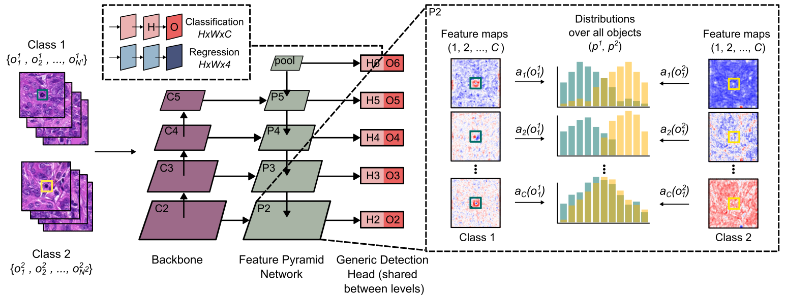

# Investigation of Class Separability within Object Detection Models in Histopathology

> Object detection is one of the most common tasks in histopathological image analysis and generalization is a key requirement for the clinical applicability of deep object detection models.  
However, traditional evaluation metrics often fail to provide insights into why models fail on certain test cases, especially in the presence of domain shifts. In this work, we propose a novel quantitative method for assessing the discriminative power of a model's latent space. Our approach, applicable to all object detection models with known local correspondences  such as the popular RetinaNet, FCOS, or YOLO approaches, allows tracing discrimination across layers and coordinates.  We motivate, adapt, and evaluate two suitable metrics, the generalized discrimination value and the Hellinger distance, and incorporate them into our approach.
Through empirical validation on real-world histopathology datasets, we demonstrate the effectiveness of our method in capturing model discrimination properties and providing insights for architectural optimization. This work contributes to bridging the gap between model performance evaluation and understanding the underlying mechanisms influencing model behavior.

<div align="center">
    <a href="./">
        
    </a>
</div>

## Organization of this repository

This repository contains the code to generate the metrics presented in our paper using the YOLOv7 architecture. The repository is based on the official YOLOv7 implementation. We provide additional code for the training and evaluation on histopathology datasets and to construct the presented metrics. 

- `extract_features.py` contains the code to extract the features from the datasets used in our study.
- `compute_distance.py` contains the code to construct the separability metrics.


## Getting started

Run the following code and check out the `MIDOGpp_demo.ipynb`. Installing all the dependencies may take a while. 

```
python -m venv demo_env
source demo_env/bin/activate
pip install -r requirements.txt
```

If you want to train your own model you need to download the inital weights for the specific model.

[`yolov7_training.pt`](https://github.com/WongKinYiu/yolov7/releases/download/v0.1/yolov7_training.pt) [`yolov7x_training.pt`](https://github.com/WongKinYiu/yolov7/releases/download/v0.1/yolov7x_training.pt) [`yolov7-w6_training.pt`](https://github.com/WongKinYiu/yolov7/releases/download/v0.1/yolov7-w6_training.pt) [`yolov7-e6_training.pt`](https://github.com/WongKinYiu/yolov7/releases/download/v0.1/yolov7-e6_training.pt) [`yolov7-d6_training.pt`](https://github.com/WongKinYiu/yolov7/releases/download/v0.1/yolov7-d6_training.pt) [`yolov7-e6e_training.pt`](https://github.com/WongKinYiu/yolov7/releases/download/v0.1/yolov7-e6e_training.pt)

## Citation

J. Ammeling, J. Ganz, F. Wilm, K. Breininger and M. Aubreville, "Investigation of Class Separability within Object Detection Models in Histopathology," in IEEE Transactions on Medical Imaging. [](https://doi.org/10.1109/TMI.2025.3560134)
